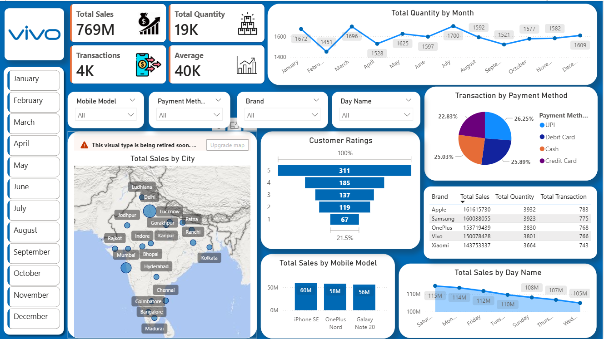

# 📊 Mobile Sales Dashboard (Power BI)

## 🔹 Project Overview
This project is an interactive Power BI dashboard used to analyze mobile sales data across cities, brands, and time. It helps in understanding sales trends, customer behavior, and business performance.

---

## 🔹 Key Features
- Total Sales, Quantity & Transactions KPIs
- Monthly Sales Trends
- City-wise Sales Analysis (Map)
- Payment Method Insights (UPI, Cash, Card)
- Customer Ratings Analysis
- Brand-wise Performance
- Dynamic Filters for detailed analysis

---

## 🔹 Tools Used
- Power BI
- Excel / CSV Dataset

---

## 🔹 Dashboard Insights
- Peak sales observed in certain months
- UPI is the most used payment method
- Top brands generate highest revenue
- Sales differ across cities and days

---
## 🔹 Project Overview
This project is an interactive Power BI dashboard used to analyze mobile sales data across cities, brands, and time.

---

## 🔹 How to Use
1. Download the `.pbix` file  
2. Open in Power BI Desktop  
3. Explore using filters  

---

## 🔹 Author
Harshal Patil
